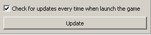
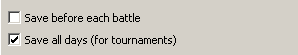
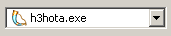

# Chapter 1 - Setup
## Lesson 1 - What do you need to play online?

### Game version
You need one of these releases: Shadow of Death, Gold Edition or Complete. If you don't have the Shadow of Death expansion available (check the campaigns menu), then the easiest way to get it is to buy Complete edition on [Good Old Games](https://www.gog.com/game/heroes_of_might_and_magic_3_complete_edition).  
**Important**: Do NOT buy HD edition available on Steam. It has no expansions and it will never have any. It is also incompatible with existing mods and tools, and is more expensive than the original Complete release. In other words, HD edition is a total scam.

### Game modifications
Despite Heroes 3 being completely playable without any tweaks, it gains quite a bit from fanmade modifications.

The most essential modification is [HD mod](https://sites.google.com/site/heroes3hd/) - not only it lets you play in a resolution higher than measly 640x480, but it also has some improvements that make it almost mandatory at this point. Some of these include repeatable quick combat, keyboard shortcuts for army management and chess timer. It also fixes some bugs, and gives more options for the random map generator.

Another important mod is an unofficial expansion [Horn of the Abyss](http://heroescommunity.com/viewthread.php3?TID=39830) - it improves balance of the game, adds a completely new faction, fixes many bugs, and adds more content in general. It is also much more beginner-friendly. It also comes with HD mod by default.

Both of the modifications are available free of charge, and are widely used in the online play. They are also easy to install.

**Important**: It is possible to play multiplayer without those mods, but this tutorial assumes playing with HotA expansion. Some of the strategies are different from the ones used in Shadow of Death, and some are related to the new content in the Horn of the Abyss.

### Preparation
After you install HD mod and HotA, run HD Launcher. The first thing you should do is to check for updates. If there are any - install them.  
  
After you have updated the HD mod, adjust the settings to your liking. I recommend checking the daily save option - it is useful for checking the map after the completed match and analysis. It is also useful for difficult single player maps and campaigns.   

When you are ready, select
 from the dropdown list and run the game.

You might see an information about Heroes 3 requiring DirectPlay - accept installation of this component.

If you have never played Horn of the Abyss before, you should play around a bit with the new faction in singleplayer - Cove - before continuing to the [next lesson](lesson002.md).
