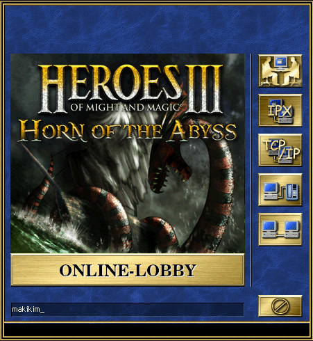
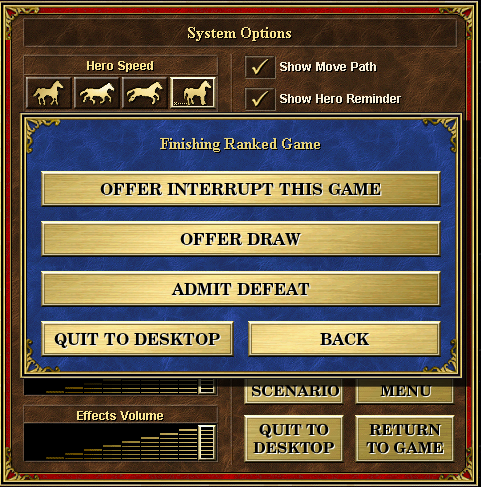

# Chapter 1 - Setup
## Lesson 2 - Online lobby

### Joining the lobby
First thing you have to do is to create an account. Open the game, click "New Game", then click "Multiplayer". You will see this window:  

Click the big "Online-Lobby" button, then "create an account" button, then fill the form. Read the rules, then accept them. After this you can log in and enter the lobby. Here you can chat with other players, see who else is online, create or join a room, see who is the highest ranked player and see your ranking points and reputation.

### Ranking system
The online lobby has a ranking system - everyone starts at zero ranking points, winning increases them, losing decreases them. It is impossible to go below zero ranking points, and only the ranked games can change the ranking.

#### **EXTREMELY IMPORTANT**  
If you are in a ranked game, and you want to surrender, you **HAVE** to click "admit defeat" button that is found in options after you click the "Quit to desktop" button, or type "gg" then confirm admitting defeat. Not doing so will often result in you being blacklisted by the other player, being reported, or even banned from the online lobby. This only applies to ranked games - in unranked games the "admit defeat" button isn't available.  

### Reputation system
The online lobby also features a reputation system. Everyone starts at zero reputation, but it can go into the negative values. When someone adds you to their friendlist, your reputation will grow. If someone will add you to their blacklist, your reputation will drop. Reaching negative reputation can result in most people not wanting to play with you.

### Online rules
You will probably also notice "Online gaming rules", which leads to [this](http://h3hota.com/en/rules) link. The rules, and common modifications to them will be explained in the [next chapter](../Chapter02/lesson003.md) - be sure to read it before hopping into a game with someone you don't know.
