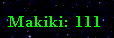

# Chapter 2 - Rules and customs
## Lesson 3 - Common rules, part 1
Despite Horn of the Abyss improving the balance of the game, some of the things can only be regulated through additional rules you have to keep mind of.

### Tournament rules setting
  
This is a setting that will be used for nearly all matches you will play. It forces some rules that aren't normally enforced ingame:
* No joiners - you can't join neutral units to your army, and the effects of Diplomacy skill are limited to cheaper surrender and earlier access to the Library of Enlightenment.
* Limited Dimension Door - you can cast Dimension Door spell only once per hero during a single turn. The only exception is when your hero has Expert Air Magic, and the map is XL+underground size or larger - then you are allowed to cast it twice.
* No hit and run - if you attack an enemy hero, and cast a spell during the first turn, you can't surrender or retreat until the end of the first turn. This restriction doesn't apply in the second or later turns, and it doesn't apply to defending hero.
* Cloak of the Balanced King resurrects only skeletons instead of zombies, wraiths or liches.

In other words, Tournament rules setting prevents the most unbalanced things from multiplayer games, while not taking them away from single player games.

### Restarts
  
Players are allowed to ask for restart without stating any reason a limited amount of times. The most common limit on restarts is 2 days - this means you can either ask for restart twice during a first day, or once during a second day.  
To ask for a restart, just write 111 or 112 in the chat (`tab` button), depending on the day - 111 in case of the day 1 restart, 112 for the day 2 restart. After this, the host has to use "Restart Scenario" option - resulting in a new map generation.

Knowing when to take a restart is an important skill - you don't want to play a game where you have no tools available to you.

### But what those digits mean?
You might just have asked this question while reading about restarts. It is a shorthand for month, week and day. The easiest way to explain this notation is through examples:
* Month 1, Week 2, Day 5 - shortened to 125
* Month 3, Week 4, Day 1 - shortened to 341
* Month 2, Week 1, Day 7 - shortened to 217

As you see, this is a much quicker way to convey the ingame dates.

In the [next lesson](lesson004.md), you will learn about the way how the factions are picked in competitive matches.
