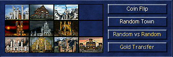
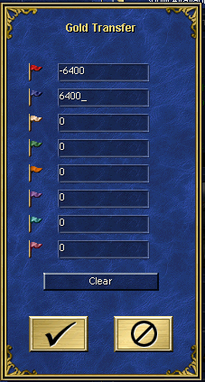
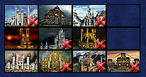

# Chapter 2 - Rules and customs
## Lesson 4 - Faction selection

If you have already seen some competitive matches, you might have seen that players don't limit themselves to a single faction. There are few commonly used ways to determine what factions players will play during the game, and two of them use the PvP-options menu.  


**IMPORTANT**: Competitive matches are played in 1v1 format. Both trade and elimination faction selection mechanism work only in this format as described.

### Trade
This is the most common way to determine the factions. Using the "Random vs Random" PvP-options menu, host generates a pair of factions, and both players are allowed to ask for a new pair once. After this, any of the players begins the bidding phase with his opening bid. A bid has to be a multiple of 100 gold, and you can't bid more than you have at start. Other player then decides to either accept the bid or raise it.  
**IMPORTANT**: In case of mirror matchup (both factions are the same), instead for the faction selection priority, players bid for the priority on the hero choice. Some players also play with a free reroll of the pair in case of mirror matchup.  
Example:
```
<SYSTEM>: Stronghold vs Conflux
Alice: 1000
Bob: 2000
Alice: 2500
Bob: 3000
Alice: 3300
Bob: 3400
Alice: 3500
Bob: 3600
Alice: ++
Bob: I pick conflux
```
Using two pluses is a common way to signal passing on the bid - other ways are to write "pass", "you take", etc. It is also common to drop the zeroes.

After the faction is picked by the winner of the bid, the next bid happens for the color. After this, the winner of the bid has to pay the other player the amount of gold they have bid. For example:
* Bob won the faction bid by declaring 3600, Alice won the color bid by declaring 1100 - this means Bob pays 3600-1100 = 2500 gold to Alice before the game begins.
* Cecil won the faction bid by declaring 5500, and also won the color bid by declaring 900 - that means he pays 5500+900 = 6400 gold to the opponent.

To perform the payment, Gold Transfer option is used - so, if in the example above Cecil would pick the red color, the gold transfer setting should be set like this:  
  
Both players can confirm if this has been set up right - a message will show up in the chat. In this case, it would be `<SYSTEM>: Red: -6400  Blue: 6400`.

After this, players choose whatever starting hero and bonus they want.

### Elimination
This is a less common, but still used method of selecting a faction, and usually results in less diverse faction setups than trade. A coin flip is made to determine who bans first. After this, players ban one faction each until there are only 3 left. The person who was the second to ban a faction chooses one first, while the other one chooses faction from the 2 left and color.  
Example:
```
Alice: ban conflux
Bob: ban dungeon
Alice: tower
Bob: cove
Alice: necropolis
Bob: fortress
Alice: castle
Bob: I take rampart
Alice: I take inferno and red color
```
  
After this, just like in case of trade, players choose whatever starting hero and bonus they want.

### All random
The least common of the standard ways of choosing factions, which is leaving faction, bonus, and hero selection as random. The colors can be picked via coin flip, but there are usually flipped in case of a subjective restart. Usually, any of the two players can call for a free restart before starting their turn if both of the players have the exact same faction.

### Pick any
The casual-only way to choose the faction. Both players choose whatever they want. Be warned though: Both players can't choose the same starting hero, which may result in arguments. I recommend the blue player to pick his faction and starting hero first.

### "But what if I play a 3-player match or more?"
Because match types other than 1v1 are uncommon to be played competitively, there are no established rules for faction selection in case of team vs team or free-for-all matches. If you wish to play it with anything else than good old all random or pick any methods, you have to come up with a solution.

The next lesson will give you the information about timer, simultaneous turns, and.
