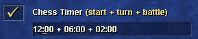
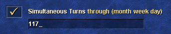

# Chapter 2 - Rules and customs
## Lesson 5 - Timer, simultaneous Turns and etiquette

### Timer
Timers are a necessity in a competitive play. Without them, players could spend hours on a single turn. While at first spending more than 4 minutes at a single turn seems more than unreasonable, soon you will see why spending a long time on a single turn is easily possible.

There are two types of timer setting - classical or chess timer. The classical timer is the simpler one - you have set amount of minutes to complete your turn, and the timer pauses during combat. If you run out of time, your turn ends.  

The chess timer is the more complicated, but is the more common one in the competitive play. It is set in the "More options" menu, using the option visible below:  
  

As you can see, there are 3 parts to this timer:
* Starting time - the time you start with at  the start of the game.
* Turn time - the additional time you are given for every turn you end. For example, if you end your turn with 9 minutes left on the timer, and the turn time is 6 minutes, you will have 15 minutes for your next turn.
* Battle time - the bonus time given to you for each combat you take. If you have any battle time left after the combat, it is taken away from you. For example, if enter the combat with 7 minutes left on the timer, after you finish the fight you can have 7 minutes of timer at most.

One thing to note is that timer still counts down during combat. If the time runs out during combat, it won't be interrupted - but the turn will end just after the fight ends.

It is important to make sure that both players know what the timer setting is.

### Simultaneous turns
Most players are using simultaneous turns option, also called simturns or sims. They are set in the "More options" menu, just like the chess timer.  

The simultaneous turns option lets players play their turns at the same time in the early game. If players interact with each other or with the same object on the map, the simultaneous turn instantly end and all players except red have to repeat their turns. That's why simturns option is given a limit - usually the earliest day when both players expect to meet. For example, if you know you can easily meet 121, you set the option to 117.  If you are confused by those three-digit numbers, make sure to have another look at the [lesson 3](lesson003.md) - this shorthand is explained there.

### Password protected savegames
Some players use this option to make cheating harder. Each player chooses a password. Loading the game online requires each player to write their savegame password, while to load the save offline the player has to write all savegames. This prevents an easy way to check and modify the savegame.  
**IMPORTANT**: Do NOT use the same password for your savegames and your account!

### Etiquette
* When making a public room on the Online Lobby, use the description to inform what timer will be used, and what template or map will be used.
* When joining a room, greet your opponent. Even a simple "hi" is enough.
* After the game ends, and you were using password protected savegames, tell your opponent what your savegame password was.
* Ask for rules - some of them may change for player to player.
* If you are hosting, and play an unknown opponent give them a primer on the rules.

The common rule changes will be described in the [next and final lesson](lesson006.md) of this chapter.
